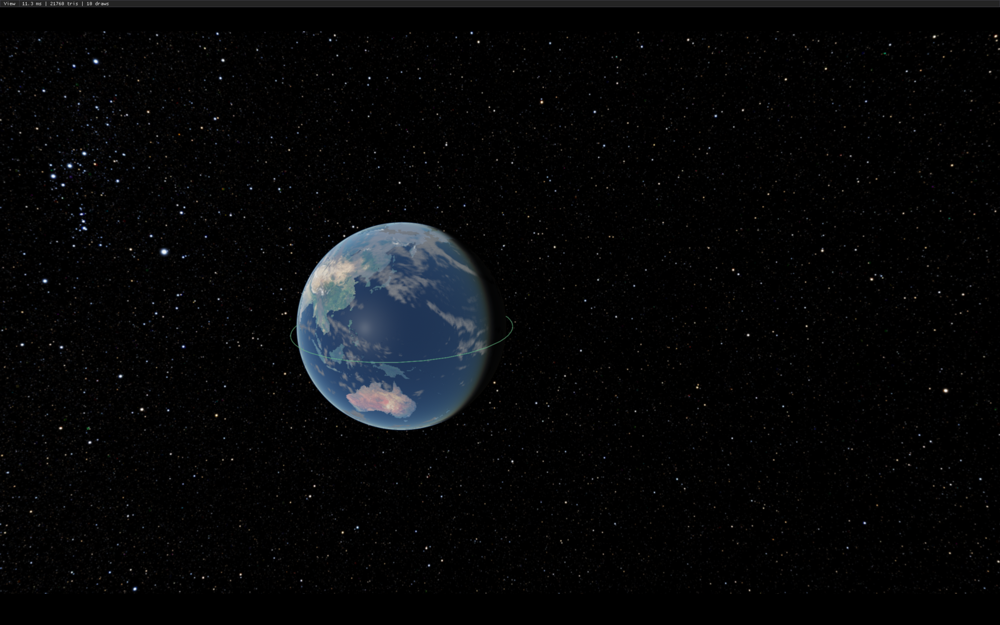
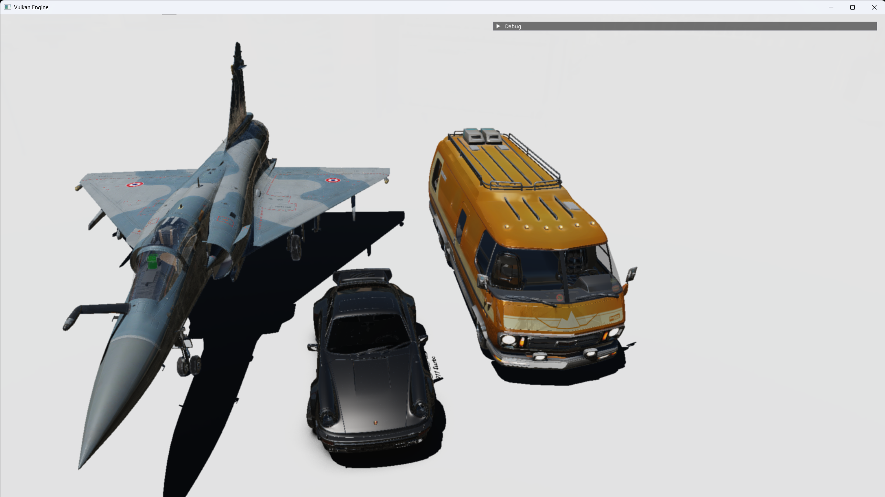
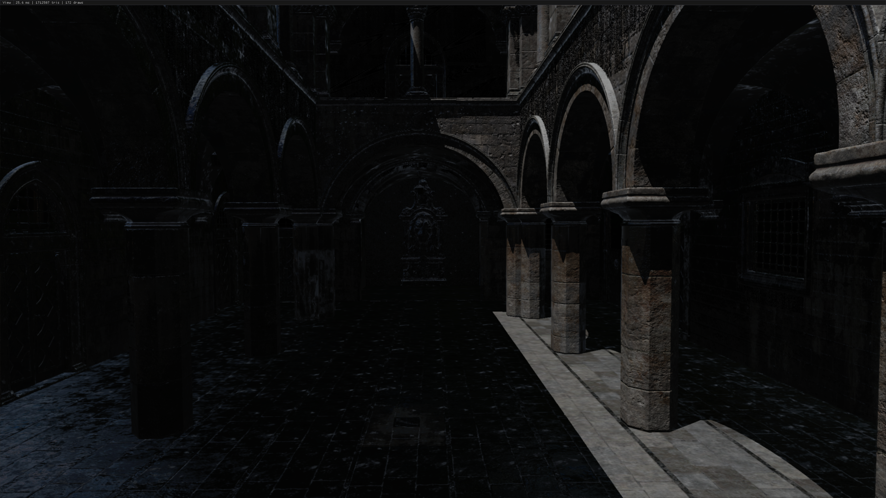
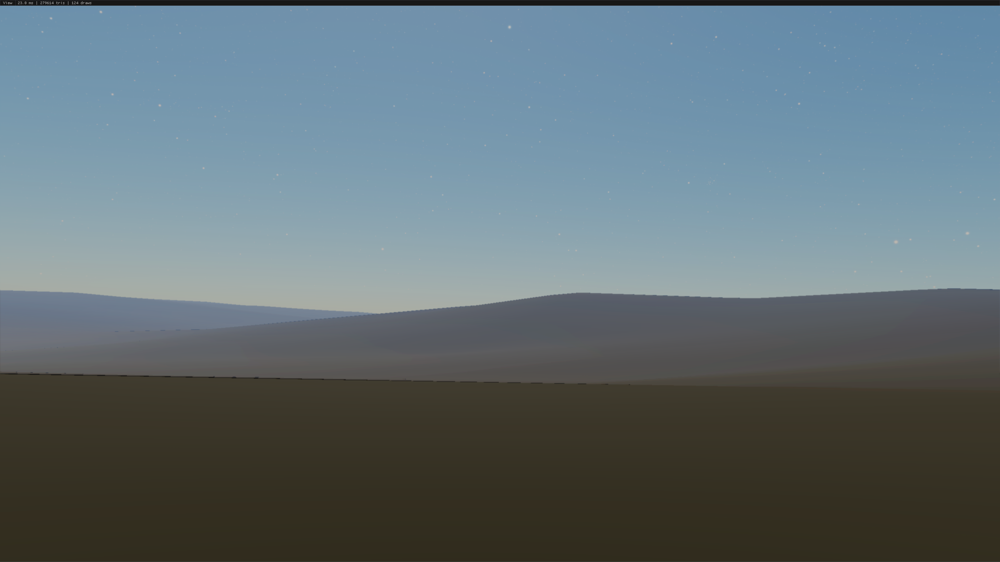

# QuaternionEngine
Multipurpose Vulkan render engine specialized for physics simulation and solar system visualization

>This repository is archived at the final open-source version. Future development continues privately.

## Introduction
Work-In-Progress Vulkan render engine
Current structure:
- Flexible render graph system with multiple render passes, Hot reloading
- Deferred rendering
- PBR, cascaded shadows, normal mapping (MikkTSpace tangents optional)
- GLTF loading and rendering, primitive creation and rendering
- Supports texture compression(BCn, non glTF standard), LRU reload
- Runtime object clicking, generation, movement
- Multi light system
- SSR
- FXAA
- Bloom
- Floating origin with double precision coordinate system
- Planet Rendering, Cubesphere-quadtree LOD Terrain system, Rayleigh-Mie scattering atmosphere
- Sun
- Physics engine integration (Jolt), sound (miniaudio)
- Celestial mechanics (Kepler, n-body), navigation
- ...AND making real game

## Build prequsites
- ktx software with libraries

## Gallery

